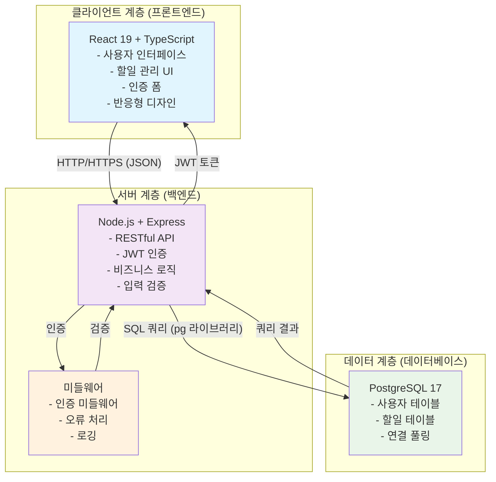

# 시스템 아키텍처 다이어그램

## 3티어 아키텍처 (프론트엔드-백엔드-데이터베이스)

## 구성 요소 설명

### 프론트엔드 (클라이언트 계층)
- **기술 스택**: React 19, TypeScript
- **주요 기능**:
  - 사용자 인터페이스 제공 (회원가입, 로그인, 할일 관리)
  - 사용자 인증/세션 관리
  - 반응형 웹 디자인 (데스크톱/모바일 지원)
  - API 호출 및 상태 관리

### 백엔드 (서버 계층)
- **기술 스택**: Node.js, Express.js
- **주요 기능**:
  - RESTful API 제공 (인증, 할일 CRUD)
  - JWT 기반 인증 처리
  - 비즈니스 로직 처리
  - 입력 검증 및 오류 처리

### 데이터베이스 (데이터 계층)
- **기술 스택**: PostgreSQL 17
- **주요 기능**:
  - 사용자 정보 저장
  - 할일 데이터 저장
  - 데이터 무결성 보장
  - 연결 풀링을 통한 성능 최적화

## 데이터 흐름

1. 사용자가 프론트엔드에서 요청을 보내면
2. 백엔드 서버가 인증 및 유효성 검사를 수행하고
3. 데이터베이스와 상호작용하여 결과를 반환
4. 프론트엔드는 받은 데이터를 UI에 반영