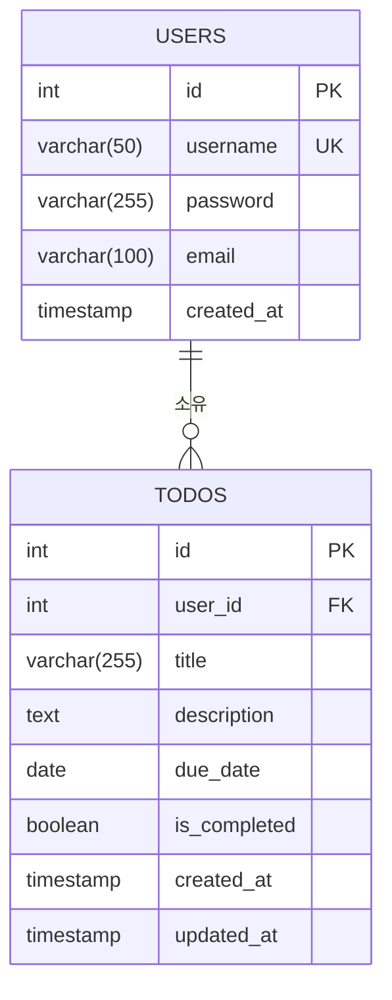

# 데이터베이스 ERD

## 엔티티 관계 다이어그램

## 엔티티 설명

### USERS 테이블
- **id**: 사용자 고유 식별자 (SERIAL PRIMARY KEY)
- **username**: 사용자명 (VARCHAR(50), UNIQUE NOT NULL)
- **password**: 비밀번호 (VARCHAR(255), bcrypt 해시 저장)
- **email**: 이메일 주소 (VARCHAR(100), NOT NULL)
- **created_at**: 가입일시 (TIMESTAMP, DEFAULT CURRENT_TIMESTAMP)

### TODOS 테이블
- **id**: 할일 고유 식별자 (SERIAL PRIMARY KEY)
- **user_id**: 작성자 ID (INTEGER, FOREIGN KEY REFERENCES users(id) ON DELETE CASCADE)
- **title**: 할일 제목 (VARCHAR(255), NOT NULL)
- **description**: 할일 상세 내용 (TEXT, 선택)
- **due_date**: 마감 날짜 (DATE, 선택)
- **is_completed**: 완료 여부 (BOOLEAN, DEFAULT false)
- **created_at**: 생성일시 (TIMESTAMP, DEFAULT CURRENT_TIMESTAMP)
- **updated_at**: 수정일시 (TIMESTAMP, DEFAULT CURRENT_TIMESTAMP)

## 관계 설명

- **USERS와 TODOS**: 1:N 관계
  - 하나의 사용자는 여러 할일을 가질 수 있음
  - 할일은 반드시 하나의 사용자에 속함
  - 사용자 삭제 시 해당 사용자의 모든 할일이 함께 삭제됨 (ON DELETE CASCADE)
  
## 인덱스

- `idx_todos_user_id`: user_id 컬럼에 대한 인덱스 (성능 최적화)
- `idx_todos_is_completed`: is_completed 컬럼에 대한 인덱스 (완료 상태 필터링용)