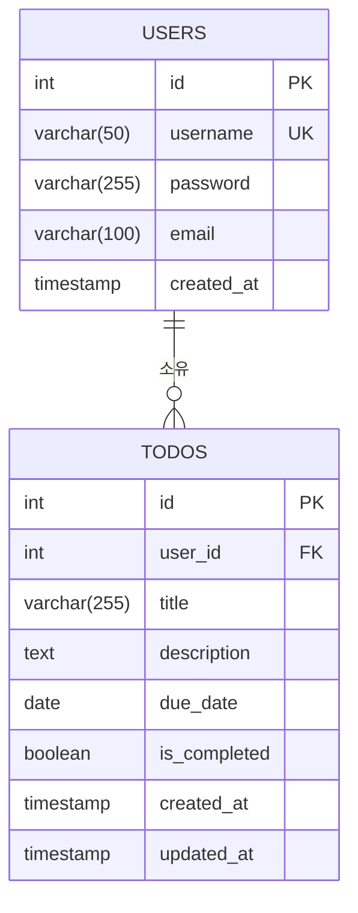

# 데이터베이스 ERD

## 문서 정보
- **버전**: 2.0.0
- **작성일**: 2026-02-11
- **최종 수정일**: 2026-02-13
- **데이터베이스**: PostgreSQL 17
- **스키마 파일**: `backend/src/db/schema.sql`

---

## 엔티티 관계 다이어그램



## 엔티티 설명

### USERS 테이블
- **id**: 사용자 고유 식별자 (SERIAL PRIMARY KEY)
- **username**: 사용자명 (VARCHAR(50), UNIQUE NOT NULL)
  - 비즈니스 규칙: 3-50자 (BR-005 참조)
- **password**: 비밀번호 해시 (VARCHAR(255), bcrypt cost factor 10)
  - 실제 해시 길이: 60자 고정
  - 저장 전 bcrypt 암호화 필수 (ADR-003 참조)
- **email**: 이메일 주소 (VARCHAR(100), NOT NULL)
  - 비즈니스 규칙: 이메일 형식 검증 (BR-006 참조)
- **created_at**: 가입일시 (TIMESTAMP, DEFAULT CURRENT_TIMESTAMP)

### TODOS 테이블
- **id**: 할일 고유 식별자 (SERIAL PRIMARY KEY)
- **user_id**: 작성자 ID (INTEGER, FOREIGN KEY REFERENCES users(id) ON DELETE CASCADE)
  - 비즈니스 규칙: 본인 할일만 접근 가능 (BR-102 참조)
- **title**: 할일 제목 (VARCHAR(255), NOT NULL)
  - 비즈니스 규칙: 1-255자, 필수 (BR-103, BR-104 참조)
- **description**: 할일 상세 내용 (TEXT, 선택)
- **due_date**: 마감 날짜 (DATE, 선택)
- **is_completed**: 완료 여부 (BOOLEAN, DEFAULT false)
  - 비즈니스 규칙: 완료/미완료 토글 (BR-105 참조)
- **created_at**: 생성일시 (TIMESTAMP, DEFAULT CURRENT_TIMESTAMP)
- **updated_at**: 수정일시 (TIMESTAMP, DEFAULT CURRENT_TIMESTAMP)
  - 자동 업데이트: 할일 수정 시 갱신 (BR-106 참조)

## 관계 설명

- **USERS와 TODOS**: 1:N 관계
  - 하나의 사용자는 여러 할일을 가질 수 있음
  - 할일은 반드시 하나의 사용자에 속함
  - 사용자 삭제 시 해당 사용자의 모든 할일이 함께 삭제됨 (ON DELETE CASCADE)
  
## 인덱스

- `idx_todos_user_id`: user_id 컬럼에 대한 인덱스 (성능 최적화)
  - 용도: 사용자별 할일 목록 조회 성능 향상
- `idx_todos_is_completed`: is_completed 컬럼에 대한 인덱스 (완료 상태 필터링용)
  - 용도: 완료/미완료 할일 필터링 성능 향상

---

## 네이밍 규칙 (Clean Architecture)

### 데이터베이스 ↔ 애플리케이션 레이어 매핑

**데이터베이스 (PostgreSQL)**: snake_case 사용
**애플리케이션 레이어**: camelCase 사용

Repository 패턴의 구현체에서 자동 변환:

| DB 컬럼 (snake_case) | 애플리케이션 (camelCase) |
|---------------------|------------------------|
| `created_at` | `createdAt` |
| `updated_at` | `updatedAt` |
| `user_id` | `userId` |
| `is_completed` | `isCompleted` |
| `due_date` | `dueDate` |

**변환 레이어**: `backend/src/frameworks-and-drivers/*RepositoryImpl.js`

**예시:**
```javascript
// DB 조회 결과 (snake_case)
const dbRow = {
  id: 1,
  user_id: 10,
  title: '할일',
  is_completed: false,
  created_at: '2026-02-13T10:00:00Z'
};

// Entity 변환 (camelCase)
const todoEntity = new Todo(
  dbRow.id,
  dbRow.user_id,      // → userId
  dbRow.title,
  dbRow.description,
  dbRow.due_date,     // → dueDate
  dbRow.is_completed, // → isCompleted
  new Date(dbRow.created_at),  // → createdAt
  new Date(dbRow.updated_at)   // → updatedAt
);
```

---

## Clean Architecture 연동

### 계층별 역할

```
┌─────────────────────────────────────────────┐
│  Entities (Domain Model)                    │
│  User.js, Todo.js                          │
│  - 비즈니스 메서드 캡슐화                      │
│  - 도메인 규칙 검증                           │
└──────────────────┬──────────────────────────┘
                   │
┌──────────────────▼──────────────────────────┐
│  Use Cases (Business Logic)                 │
│  AuthUseCases, TodoUseCases                │
│  - Repository 인터페이스 사용                 │
└──────────────────┬──────────────────────────┘
                   │
┌──────────────────▼──────────────────────────┐
│  Repository Implementations                 │
│  UserRepositoryImpl, TodoRepositoryImpl    │
│  - SQL 쿼리 실행 (pg 라이브러리)              │
│  - snake_case ↔ camelCase 변환             │
└──────────────────┬──────────────────────────┘
                   │
┌──────────────────▼──────────────────────────┐
│  PostgreSQL Database                        │
│  users, todos 테이블                        │
└─────────────────────────────────────────────┘
```

### 데이터 흐름

**생성 (Create):**
1. Controller → UseCase (Entity 객체 전달)
2. UseCase → Entity 비즈니스 검증 (`validate()`)
3. UseCase → Repository (Entity 저장 요청)
4. Repository → DB (snake_case로 변환 후 INSERT)
5. DB → Repository (생성된 row 반환)
6. Repository → UseCase (camelCase Entity 반환)

**조회 (Read):**
1. Controller → UseCase (조회 요청)
2. UseCase → Repository (데이터 조회)
3. Repository → DB (SELECT 쿼리 실행)
4. DB → Repository (snake_case rows)
5. Repository → Entity 변환 (camelCase)
6. Repository → UseCase → Controller (Entity 반환)

---

## 제약 조건 (Constraints)

### Primary Keys
- `users.id`: SERIAL (자동 증가)
- `todos.id`: SERIAL (자동 증가)

### Unique Constraints
- `users.username`: 중복 불가 (E-001 에러)

### Foreign Keys
- `todos.user_id` REFERENCES `users(id)` ON DELETE CASCADE
  - 사용자 삭제 시 해당 사용자의 모든 할일 자동 삭제

### Not Null Constraints
- `users.username`, `users.password`, `users.email`
- `todos.user_id`, `todos.title`

### Default Values
- `todos.is_completed`: false
- `users.created_at`, `todos.created_at`, `todos.updated_at`: CURRENT_TIMESTAMP

---

## 보안 고려사항

### 비밀번호 보안
- ✅ bcrypt 해시 저장 (평문 저장 금지)
- ✅ Cost factor 10 이상 (ADR-003)
- ✅ 해시 길이: 60자 고정 (VARCHAR(255)는 충분한 여유)

### SQL Injection 방어
- ✅ Parameterized Queries 사용 (pg 라이브러리)
- ❌ 문자열 결합 방식 금지

**안전한 예시:**
```javascript
const result = await client.query(
  'SELECT * FROM todos WHERE user_id = $1',
  [userId]
);
```

**위험한 예시 (절대 사용 금지):**
```javascript
// ❌ SQL Injection 취약점
const result = await client.query(
  `SELECT * FROM todos WHERE user_id = ${userId}`
);
```

### 접근 제어
- ✅ JWT 토큰 기반 인증 (ADR-001)
- ✅ userId 기반 소유권 검증 (BR-102)
- ✅ 타인의 데이터 접근 방지 (E-102 에러)

---

## 문서 변경 이력

### Version 2.0.0 (2026-02-13)
**추가:**
- 문서 정보 섹션 추가
- 비즈니스 규칙(BR) 및 ADR 참조 추가
- 네이밍 규칙 (snake_case ↔ camelCase 매핑) 섹션 추가
- Clean Architecture 연동 다이어그램 추가
- 데이터 흐름 설명 추가
- 제약 조건 상세 설명 추가
- 보안 고려사항 섹션 추가 (bcrypt, SQL Injection 방어, 접근 제어)
- 변경 이력 추가

**개선:**
- 각 컬럼에 대한 설명 강화
- 인덱스 용도 명시
- 실제 schema.sql 파일 경로 명시

---

### Version 1.0.0 (2026-02-11)
- 초기 ERD 다이어그램 작성
- 기본 테이블 구조 정의
- 관계 및 인덱스 정의